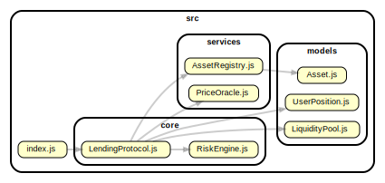

# Architecture Overview

## Project Structure

This section provides a high-level overview of the project's directory and file structure, categorised by architectural layer or major functional area. It is essential for quickly navigating the codebase, locating relevant files, and understanding the overall organization and separation of concerns.

```
[ducat-demo]/
src/
├── core                               # Core business logic
│   ├── LendingProtocol.js             # Main orchestrator - public API
│   └── RiskEngine.js                  # Risk calculations and liquidation logic
├── index.js                           # Entry point and demo
├── models                             # Data structures
│   ├── Asset.js                       # Asset definition class
│   ├── LiquidityPool.js               # Pool management with interest rate curves
│   └── UserPosition.js                # User collateral and loan tracking
└── services                           # External integrations
    ├── AssetRegistry.js               # Asset catalog and risk parameters
    └── PriceOracle.js                 # Price feeds (mock - production would use Polygon, FMDQ)
tests/                                 # Unit tests
├── core
│   ├── LendingProtocol.test.js
│   └── RiskEngine.test.js
├── models
│   ├── Asset.test.js
│   ├── LiquidityPool.test.js
│   └── UserPosition.test.js
└── services
    ├── AssetRegistry.test.js
    └── PriceOracle.test.js
docs/
├── architecture.md
└── dependency-graph.svg
├── .gitignore                        # Specifies intentionally untracked files to ignore
├── package.json                      # Project configuration
└── README.md                         # Project overview and quick start guide
```

## Component Responsibilities



**Core Layer** (`src/core/`)

- `LendingProtocol.js`: Main entry point, orchestrates all other components, provides public API
- `RiskEngine.js`: Calculates collateral values, loan values, health factors, and liquidation amounts

**Models** (`src/models/`)

- `Asset.js`: Defines properties of tradable assets
- `LiquidityPool.js`: Manages deposits, borrows, and algorithmic interest rate adjustments
- `UserPosition.js`: Tracks individual user's collateral deposits and loans

**Services** (`src/services/`)

- `AssetRegistry.js`: Central registry of all supported assets with risk parameters
- `PriceOracle.js`: Provides asset prices (mock implementation - production integrates with real APIs)

### Design Patterns

**Dependency Injection**: Core components receive their dependencies through constructors, making testing easier and reducing coupling.

```javascript
// RiskEngine doesn't import its dependencies
constructor(assetRegistry, priceOracle) {
  this.assetRegistry = assetRegistry;
  this.priceOracle = priceOracle;
}

// LendingProtocol creates and injects them
this.riskEngine = new RiskEngine(this.assetRegistry, this.priceOracle);
```

**Single Responsibility**: Each class has one clear purpose - pools manage liquidity, positions track user data, risk engine calculates risk metrics.

**Separation of Concerns**: Business logic (core) is separated from data structures (models) and external integrations (services).

## How It Works

### 1. Over-Collateralization

Users must deposit collateral worth more than what they borrow. For example:

- Deposit $1,500 worth of stocks
- Borrow up to $1,000 (or ₦1,650,000)

This protects lenders if collateral value drops. Different assets have different collateral requirements:

- US Stocks: 150% (deposit $1.50 to borrow $1)
- US ETFs: 140% (deposit $1.40 to borrow $1)
- Treasuries: 120% (deposit $1.20 to borrow $1)

### 2. Algorithmic Interest Rates

Interest rates adjust automatically based on how much of the pool's liquidity is borrowed (utilization):

```
Low utilization (0-75%):  Low rates → encourages borrowing
High utilization (75%+):   Steep rates → encourages deposits, discourages borrowing
```

Example rates:

- NGN base rate: 18% (reflecting Nigerian lending market)
- USD base rate: 5%
- Rates can spike to 60%+ at very high utilization

### 3. Health Factor & Liquidation

**Health Factor** = Collateral Value / Loan Value

- **> 1.15**: Position is safe
- **< 1.15**: Position can be liquidated

When liquidated:

1. Liquidator repays part of the loan
2. Receives collateral worth 105% of repayment (5% bonus)
3. Borrower's position is partially or fully closed

This protects the protocol from bad debt if collateral prices crash.

### 4. Interest Accrual

Interest accrues continuously based on time elapsed and current pool rates:

```javascript
interest = principal × rate × time
```

Interest is calculated every time a user interacts with their position (borrow, repay, or view).

## Risk Parameters

### Asset-Specific Haircuts

Collateral values are discounted for risk:

| Asset Type | Haircut | Reason                     |
| ---------- | ------- | -------------------------- |
| US Stocks  | 15%     | Higher volatility          |
| US ETFs    | 10%     | Diversified, less volatile |
| Treasuries | 5%      | Very stable                |
| NGN Cash   | 2%      | Currency risk only         |

### Example Calculation

Depositing 10 shares of AAPL at $185/share:

1. Nominal value: $1,850
2. With 15% haircut: $1,572.50 effective collateral
3. Can borrow: $1,572.50 / 1.3 = $1,209 (or ₦1,995,000)

## API Reference

### For Liquidity Providers

```javascript
// Deposit NGN or USD to earn interest
protocol.depositToPool(lpId, "NGN", 5000000);
// Returns: { success, message, poolStats }
```

### For Borrowers

```javascript
// 1. Deposit collateral
protocol.depositCollateral(userId, "AAPL", 10);
// Returns: { success, message, borrowingPower }

// 2. Borrow against collateral
protocol.borrow(userId, "NGN", 1000000);
// Returns: { success, message, healthFactor, interestRate }

// 3. Repay loan
protocol.repay(userId, "NGN", 500000);
// Returns: { success, message, remainingDebt }
```

### For Liquidators

```javascript
// Liquidate unhealthy positions for profit
protocol.liquidate(userId, liquidatorId, "NGN", 500000);
// Returns: { success, message, seized, bonus }
```

### View Functions

```javascript
// Check user's position
protocol.getPosition(userId);
// Returns: { collateral, loans, healthFactor, borrowingPower }

// Check pool stats
protocol.getPool("NGN");
// Returns: { totalDeposited, totalBorrowed, utilization, interestRate }
```

### Price Updates

```javascript
// Update asset prices (in production, called by automated oracle)
protocol.updatePrice("AAPL", 185, "USD");
// Returns: { success, message, liquidationOpportunities }
```

## Production Considerations

### Price Oracle Integration

Currently uses mock prices. In production, integrate with:

**For US Stocks/ETFs:**

- Polygon.io
- Alpha Vantage
- IEX Cloud
- Finnhub

**For NGN Exchange Rates:**

- FMDQ (official interbank rates)
- Central Bank of Nigeria API
- Aboki Forex (parallel market rates)

Example integration:

```javascript
async fetchFromPolygon(symbol) {
  const response = await fetch(
    `https://api.polygon.io/v2/aggs/ticker/${symbol}/prev?apiKey=${API_KEY}`
  );
  const data = await response.json();
  this.update(symbol, data.results[0].c, 'USD');
}
```

### Broker Integration

To access users' actual stock holdings, integrate with:

- Risevest API
- Bamboo API
- Trove API

This allows the protocol to:

1. Verify users own the stocks they claim
2. Lock/unlock collateral automatically
3. Execute liquidations through broker APIs

### Database Persistence

Current implementation uses in-memory storage (Maps).

Production needs:

- PostgreSQL or MongoDB for positions, pools, transactions
- Redis for caching price data
- Time-series database for historical metrics

### Regulatory Compliance

Nigerian fintech must implement:

- KYC/AML verification
- Transaction reporting to regulatory bodies
- Anti-money laundering monitoring
- Lending license requirements

### Security

- Smart contract audit equivalent (code review)
- Multi-signature wallets for protocol treasury
- Rate limiting on API endpoints
- Price manipulation detection
- Circuit breakers for extreme volatility

## Extending the Protocol

### Adding New Assets

```javascript
// In AssetRegistry.initializeAssets()
this.register("NFLX", "US_STOCK", "Netflix Inc.", false, true);

// In PriceOracle.initializePrices()
this.update("NFLX", 450, "USD");
```

### Adding New Features

**Flash Loans**: Uncollateralized loans that must be repaid within same transaction

**Multi-collateral Optimization**: Automatically select best collateral mix for liquidations

**Interest Rate Swaps**: Fixed vs variable rate options

**Insurance Fund**: Protocol-owned fund to cover bad debt

## Project Identification

Project Name: Ducat-demo

Repository URL: https://github.com/odunlemi/ducat-demo

Primary Contact/Team: Abiodun Longe (https://github.com/odunlemi/)

Date of Last Update: [2026-01-02]

<!-- ## License

[MIT](./) -->

## Glossary / Acronyms

DeFi: Decentralized Finance

Haircut: In a financial context, a haircut is the percentage difference between what an asset is worth relative to how much a lender will recognize of that value as collateral.

---

**Disclaimer**: This is a demonstration project showing DeFi lending mechanics applied to traditional finance. Not financial advice. Not audited for production use. Consult legal and financial advisors before deploying in a regulated environment.
